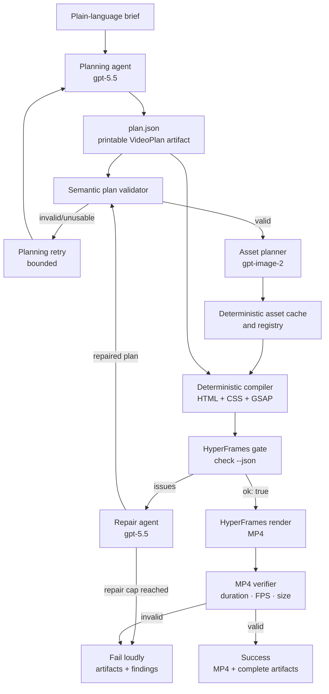

# brief-to-video — HyperFrames


An end-to-end generator that turns a plain-language creative brief into a
validated MP4 motion-graphics advertisement. It plans first with `gpt-5.5`,
generates only the imagery that materially improves the story with
`gpt-image-2`, compiles a deterministic HyperFrames composition, runs the
HyperFrames verification gate, repairs failures up to a fixed cap, renders an
MP4, and verifies the rendered file before returning success.

The printable planning artifact for every run is `plan.json`; the wider
engineering rationale is in
[Planning and system design](docs/PLANNING_AND_SYSTEM_DESIGN.md).

---

## Output videos

Both renders below were produced end-to-end — planned by `gpt-5.5`, composed
deterministically, passed the mandatory HyperFrames gate, and validated by
`ffprobe` before being written to disk.

| Run | Brief | Video |
|-----|-------|-------|
| `41083e755fe13009` | Create a 26-second widescreen video about an AI productivity assistant that helps teams work smarter. | [output.mp4](runs/41083e755fe13009/renders/output.mp4) |
| `d4b95c79d1266dbb` | Create a cinematic 20-second widescreen advertisement for an AI meeting assistant that turns chaotic meetings into clear action plans. | [output.mp4](runs/d4b95c79d1266dbb/renders/output.mp4) |

---

## What it does

1. Accepts a short natural-language brief.
2. Uses `gpt-5.5` structured output to create a `VideoPlan` before composition
   code or assets are generated.
3. Validates that plan semantically: timings, dimensions, assets, text, motion,
   and assertions.
4. Uses `gpt-image-2` only where a generated image helps the visual story.
5. Deterministically compiles supported scenes and GSAP motion into a
   HyperFrames composition.
6. Runs `npx hyperframes check <composition> --json` on every generated
   composition.
7. Sends gate failures to a capped `gpt-5.5` repair loop; it recompiles and
   rechecks after each successful repair.
8. Renders only after the gate reports `ok: true`, then validates the MP4 with
   `ffprobe`-based checks for file existence, dimensions, frame rate, and
   duration.

---

## Architecture



The compiler owns implementation detail: typography, safe layout zones,
responsive 16:9 / 9:16 / 1:1 treatments, motion easing, image-safe camera
drift, and premium deterministic UI primitives. The model owns the creative
plan: message, scene sequence, copy, imagery intent, timing, and motion
intent. This boundary prevents the model from emitting arbitrary HTML/CSS/JS
while still allowing every brief to have a distinct visual story.

---

## Clean-clone setup

### Prerequisites

- Python 3.11+ (tested with Python 3.14)
- Node.js 22+ (`hyperframes` requires Node 22 or newer)
- Docker Desktop running (the pipeline renders with `--docker`)
- An OpenAI-compatible gateway key with access to `gpt-5.5` and `gpt-image-2`

### Install

```bash
git clone https://github.com/varshithreddy39/brief-to-video-HyperFrames.git
cd brief-to-video-HyperFrames

python -m venv .venv
source .venv/bin/activate
pip install -r requirements.txt

npm ci

cp .env.example .env
```

Edit `.env` and replace `OPENAI_API_KEY` with your private key. Do not commit
this file.

```dotenv
OPENAI_API_KEY=your_private_key
OPENAI_BASE_URL=https://your-openai-compatible-gateway/v1
PLANNER_MODEL=gpt-5.5
IMAGE_MODEL=gpt-image-2
```

---

## Run one brief

```bash
python -c "
from app.orchestrator.pipeline import run_pipeline
r = run_pipeline('Create a 12 second ad for a developer tool, dark theme, purple accent, three feature callouts, ends on a call to action.')
print('SUCCESS')
print(r.output_path)
print('HyperFrames:', r.hyperframes_check.ok)
print('MP4:', r.mp4_validation.ok)
"
```

On success, the command prints the MP4 path and `True` for both validation
steps. The run is stored under `runs/<deterministic-brief-hash>/`.

---

## Artifacts produced by every run

```text
runs/<run_id>/
├── brief.txt                   # normalized source brief
├── plan.json                   # printable GPT-5.5 structured plan
├── assets/
│   ├── registry.json           # asset ID → deterministic cached file
│   └── *.png                   # gpt-image-2 output where needed
├── composition/
│   ├── index.html
│   ├── styles.css
│   ├── timeline.js
│   └── index.motion.json
├── checks/
│   ├── attempt_0.json          # HyperFrames check result
│   ├── attempt_1.json          # present only after repair
│   └── mp4.json                # post-render verifier result
├── renders/
│   └── output.mp4
└── logs/
    ├── pipeline.log
    └── render.log
```

Two complete runs are committed to this repository:

- [`runs/41083e755fe13009/`](runs/41083e755fe13009/)
- [`runs/d4b95c79d1266dbb/`](runs/d4b95c79d1266dbb/)

All other run output is git-ignored.

---

## Verification and repair contract

The HyperFrames gate is mandatory. The pipeline does **not** render an MP4
until it receives `{"ok": true}` from:

```bash
npx hyperframes check runs/<run_id>/composition --json
```

The gate checks lint, runtime behavior, layout, motion, and WCAG contrast.
When it reports issues, the pipeline normalizes and prioritizes the findings,
asks `gpt-5.5` for a repaired `VideoPlan`, validates that plan, recompiles,
and reruns the same gate. `MAX_REPAIR_ATTEMPTS` defaults to `3`; exceeding the
cap raises `PipelineError` with the run directory and remaining diagnostics.

---

## Determinism

The normalized brief is SHA-256 hashed to derive its run directory. Repeating
the same brief reuses its saved validated `plan.json` and cached asset files,
then recompiles the same deterministic composition. There is no random layout,
copy, or asset-cache key in the renderer.

The exact rendered bytes may vary across Docker platform/Chrome versions. The
visual plan, assets, source composition, timing, and expected media properties
remain deterministic for a fixed environment.

---

## Scope deliberately cut

This project focuses on the core: creative planning, deterministic composition,
self-verification, bounded repair, and reproducible artifacts. It intentionally
does not include cloud deployment, a web UI, voiceover/music, multilingual TTS,
a brand-asset upload workflow, or arbitrary model-authored HTML. Those would add
surface area without improving the self-correcting rendering loop being evaluated.
