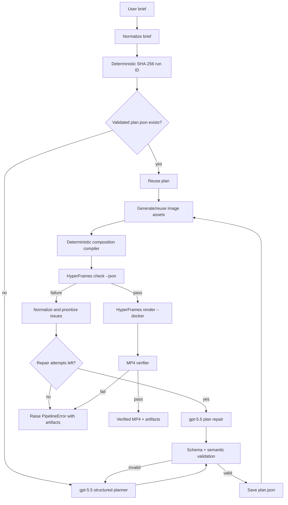

# Planning and System Design

## 1. Problem interpretation

The problem is not merely generating HTML that resembles a motion graphic. It
is building a reliable, no-human-in-the-loop system that transforms a brief
into a real MP4 and refuses to ship a broken composition.

The system must therefore solve two related problems:

1. Turn ambiguous language into a useful, inspectable creative plan before
   any code is generated.
2. Treat rendering as a verified production process: validate the plan,
   generate only needed assets, compile deterministically, run the official
   HyperFrames gate, repair actionable failures within a cap, render, and
   verify the MP4.

The strongest artifact of the creative reasoning is `plan.json`. It records
scene count, timings, scene types, copy, design intent, motion specifications,
assets, and motion assertions. It is saved before rendering and can be printed
or reviewed independently from implementation code.

## 2. System design

### Components and data flow

| Component | Input | Output | Failure handling |
| --- | --- | --- | --- |
| Planner | normalized brief | typed `VideoPlan` | retries invalid/refused/unparseable model output with concise validation feedback |
| Plan validator | `VideoPlan` | semantic pass/fail | rejects invalid timings, unsupported formats, bad assets, unusable text/motion |
| Asset generator | `AssetSpec` | deterministic cached PNG + registry | checks OpenAI response, `b64_json`, decode, and non-empty bytes |
| Compiler | plan + registered assets | HTML, CSS, GSAP, motion assertions | deterministic primitives prevent arbitrary model-generated code |
| HyperFrames gate | composition directory | authoritative JSON findings | blocks rendering unless `ok` is true |
| Repair agent | plan + normalized gate issues | repaired plan | capped; invalid repairs return to the repair loop or fail loudly |
| Renderer + MP4 verifier | checked composition | MP4 + media report | confirms a non-empty MP4 with expected resolution, FPS, and duration |

## 3. Key choices and rejected alternatives

### Chosen: structured planning before composition

`gpt-5.5` returns a Pydantic-constrained `VideoPlan`, not free-form prose or
implementation code. This makes the planning step inspectable, validates it
before an expensive image/render step, and allows repair to modify the plan
rather than fragile compiled files.

### Chosen: deterministic compiler with a small scene vocabulary

The planner selects supported scene types (`hero`, `feature`, `feature_grid`,
`image`, `stats`, `cta`) and motion intent. The compiler owns exact element
IDs, safe reading zones, responsive layout, contrast-safe primitives, and GSAP
implementation. This preserves creative variety while making the output
verifiable.

Rejected: allowing a model to emit arbitrary HTML/CSS/JS. It would expand the
attack surface, make deterministic reruns difficult, and make repair findings
less actionable.

### Chosen: images only when they add narrative value

`gpt-image-2` supplies a cinematic scene, product context, or visual metaphor
when it materially improves a shot. Feature grids, stats, and diagnostic
visuals are crisp deterministic HTML primitives. This avoids fake UI
micro-text, keeps copy accessible, and does not waste image calls on
decorative filler.

### Chosen: gate before render, with bounded repair

The official HyperFrames gate is the authority on runtime, layout, motion, and
contrast. Rendering waits for a pass. Failures are normalized by category and
priority, repaired from the plan where appropriate, revalidated, recompiled,
and rechecked. The loop has a hard cap so the system fails transparently rather
than claiming success after a broken render.

### Chosen: deterministic cache identity

The run ID comes from the normalized brief. Image-cache keys include the model,
asset ID, scene, prompt, and requested size. Consequently a repeated brief
reuses the accepted plan and bytes already generated for the assets.

## 4. Handling wrong model output

Model failure is expected, so it is handled at multiple boundaries.

1. **No reply, refusal, malformed structured output, or schema failure:** the
   planner retries up to `MAX_PLAN_RETRIES` with the previous failure fed back
   as actionable context.
2. **Semantically unusable plan:** the validator rejects it before image
   generation; examples include bad timings, nonexistent assets, invalid media
   formats, and motion outside a scene.
3. **Bad image response:** the asset generator verifies response data,
   `b64_json`, base64 decoding, and output bytes before registering the file.
4. **Composition failure:** the HyperFrames JSON gate supplies concrete
   findings. The repair loop only proceeds with a schema-valid repaired plan,
   recompiles from scratch, and reruns the same gate.
5. **Repair cap reached:** `PipelineError` includes the run directory, repair
   attempt count, and unresolved gate findings. A failed video is never
   rendered or returned as success.
6. **Broken output file:** post-render validation rejects empty output or media
   whose duration, dimensions, or FPS do not match the plan.

Some errors are deterministic compiler concerns rather than creative-plan
concerns. The compiler includes safeguards for those recurring classes:
non-overlapping copy regions, full-frame image movement via safe internal crop
drift rather than scale overflow, contrast-safe card labels, and subtle scene
ambient motion so an ending cannot freeze prematurely.

## 5. Deliberate cuts

The following were intentionally excluded from the 48-hour scope.

| Cut | Why it was dropped |
| --- | --- |
| Cloud deployment / queue workers | Local, artifact-rich execution is sufficient to prove the core workflow; cloud infrastructure would not improve verification quality. |
| Browser UI | A CLI provides the clearest reproducible demonstration and keeps time focused on the evaluator's core concerns. |
| Voiceover, music, TTS, and captions | These introduce timing, licensing, mixing, and multi-language failure modes unrelated to the visual planning/repair problem. |
| Arbitrary product screenshots or live SaaS integrations | They add account/secrets management and make deterministic reruns less reliable. Deterministic UI primitives communicate product behavior cleanly. |
| Unlimited self-repair | Retrying indefinitely hides failure and can burn API budget. A bounded, artifact-rich failure is more honest and debuggable. |

## 6. Submission evidence

For each of the three briefs in `briefs/`, the final submission should include
the corresponding `submission/runs/<run_id>/` directory. It contains the exact
brief, printable plan, passing HyperFrames JSON report, final MP4 validation,
rendered video, assets, composition source, and logs. This makes each demo
claim reproducible and inspectable.
